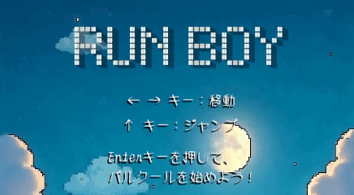

# Run Boy - Unity ゼロからの一日チャレンジ！
# 從零開始挑戰一天學會用Unity！
# A One-Day Challenge to Learn Unity from Scratch!

簡単な2D横スクロールゲームを作れるのか？Unity初心者の挑戦が始まる！

## 使用ツール
- Unity 6.0 (6000.0.48f1)
- C#
- Visual Studio Code
- Cursor
- Logic Pro
- Photopea
- CapCut

## 使用AIツール
- ChatGPT（コード作成・デバッグ）
- Ideogram.ai、Freepik（画像生成）
- Hailuoai（映像生成）
- SUNO（BGM生成）

## ゲーム概要
『Run Boy』は、横スクロール型のジャンプアクションゲームです。  
プレイヤーはキャラクターを左右に動かし、ジャンプしながら画面右側から出現する足場に飛び乗り、障害物を避けていきます。  
時間が経つにつれ、画面のスクロール速度が上昇し、プレイヤーの反応力と判断力が試されます。

## 制作動機
本作は、初めてUnityを使って開発した作品です。  
ゲームロジック、アニメーション制御、プレイヤー操作、C#スクリプト作成の基礎的な流れを総合的に学ぶことを目的としました。  
特にキャラクターの**物理的な当たり判定**や**速度制御**に重点を置いています。

## 技術的工夫
- **アニメーションと当たり判定の調整**：キャラが角や壁に引っかかる現象を修正し、ジャンプや着地の動きをより自然に。
- **AI素材の活用と加工**：AIで生成した画像をPhotopeaで加工し、CapCutでイントロアニメを作成。
- **Inspectorの最適化**：パラメータに日本語と中国語の説明を追加し、視認性と作業効率を向上。

## ⚠️ 苦戦ポイントと対処法
- **VSCodeとUnityの連携エラー**：`.NET SDK`のパス設定に失敗。時間短縮のため、修正は後回しにして開発を優先。
- **AI素材の生成制限**：無料生成の枚数や画質に限りがあり、Freepikや手作業の加工で対応。
- **Unityのフォント制限**：日本語や中国語が表示されず、PNG画像に変換したり、.otfの多言語対応フォントを導入して解決。

---

## 📅 開発日記

### Day 1：環境構築地獄
- ワクワクしながらUnityをインストールした直後、最初のボス「.NET SDKエラー」に遭遇。
- VSCodeを開くたびにエラー連発、半日格闘しても解決できず。
- ネットで調べ、パスを再設定し、DevKitを再インストールしてもダメ。
- 「このままエラーを無視しても開発に支障ないのでは？」と判断し、割り切ってスルー。
- **MacBook Pro 2017**のレトロな読み込み速度に悩まされながらも、開発の情熱は失われず。
- 気づけば深夜……Day1終了。

---

### Day 2：素材と画像の大混戦
- Unityはさすがゲームエンジン。PythonやJavaScriptのようにゲームループを一から書く必要がなくて感動。
- でも時間が限られているので、画像やアニメをAIツールで一気に作成……が、無料プランの制限に苦しむ。
- 満足いく素材を作る前に生成回数制限、結局FreepikやPhotopeaで手動修正のループへ突入。
- Unityが多言語フォントに対応しておらず、文字をPNG化したり、日本語対応フォントを探して導入。
- 夜になってようやくキャラ画像・背景・アニメ素材が揃ったが、コードは数行だけ……Day2終了。

---

### Day 3：ついに本格開発！
- ようやくC#スクリプトを書き始め！PythonやJSの経験＋ChatGPTの支援で、論理構成は順調。
- ジャンプ、落下、スピードアップなどのロジックを組みつつ、Unityの構造にも慣れてきた。
- ファイル名やオブジェクト名を変更する時はまだ少し不安だったが、Unityは思ったより安定。
- 得点処理、死亡判定、サウンド切替、アニメ切替などを実装し、ついにシンプルなゲームが完成！

---

## 🏁 結論：チャレンジ成功…ならず！
今回のテーマは「Unityゲームを1日で完成させる」──**残念ながら失敗！**  
実際に完成するまでに**3日間**かかってしまいました。

ただし、IDEの構築やAI画像の加工を除けば、ゲームロジックや統合部分は**本当に1日でできる**と感じました！  
Unity初心者として非常に実りある経験になりました。

👏 最後まで読んでいただき、ありがとうございました！

---

- 
- 
- 
- 

---

# Run Boy - Unity 從零開始挑戰一天學會用Unity
做一個簡單橫向捲軸遊戲，是否能挑戰成功？

## 開發工具
- Unity 6.0 (6000.0.48f1)
- C#
- Visual Studio Code
- Cursor
- Logic Pro
- Photopea
- CapCut

## 使用 AI 工具
- ChatGPT（程式撰寫與除錯）
- Ideogram.ai、Freepik（圖片生成）
- Hailuoai（影片生成）
- SUNO（BGM 生成）

## 遊戲概要
『Run Boy』是橫向卷軸跳躍遊戲。玩家操作角色左右移動與跳躍，
跳上畫面右方不斷出現的足場以閃避障礙物。
隨著時間推進，畫面捲動速度會逐漸加快，考驗玩家的反應與判斷力。

## 製作動機
本作為初次使用 Unity 開發的作品，目標是全面理解遊戲邏輯、
動畫控制、玩家輸入與 C# 腳本編寫的基本流程。
特別著重在角色的**物理碰撞處理**與**速度變化控制**。

## 技術特色與工夫
- **動畫與碰撞修正**：修正角色在角落或牆邊卡住的問題，讓跳躍與落地更自然。
- **AI 素材融合**：AI產圖後透過Photopea加工，CapCut編輯intro動畫。
- **Inspector 最適化**：使用中文與日文標註inspector的參數，提升開發效率與可視性。

## ⚠️ 遇到的挑戰與解法
- **VSCode 與 Unity 整合錯誤**：`.NET SDK` 路徑錯誤無法修復，最終暫時放棄修正，優先完成作品。
- **AI 素材數量限制**：免費AI生成次數與畫質限制， 配合Freepik與手工修圖方式解決。
- **Unity 字體不支援多語系**：日文與中文顯示錯誤，改將文字轉為 PNG圖片，以及使用支援多語系的 `.otf` 字體。

---

## 📅 開發日記

### Day 1：環境安裝地獄  
- 最初開開心心的地安裝 Unity，準備開始學習遊戲引擎。  
- 沒想到馬上遇到第一隻大魔王：`.NET SDK` 錯誤，一開 VSCode 就報錯，搞了一整個下午都無法解決。  
- 上網查資料、重設路徑、重裝 DevKit 全都試了，還是沒用。  
- 最後我認真思考：「雖然會報錯，能否先暫時忽略情況下會不會影響？」最後發現不影響，所以暫時將這個錯誤先留著。  
- 我感受到我的 **MacBook Pro 2017 ** 那個復古速度感了，雖然每次讀檔慢到可以吃好幾次泡麵，但不影響我想完成的決心。  
- 就這樣進入深夜……第1天結束了。

---

### Day 2：素材與圖片大挑戰  
- Unity不愧是遊戲引擎，不需要像是python，javascript還要先寫遊戲回圈跟基本角色向量圖來初始遊戲架構。  
- 但是時間有限我想要快一點生產圖片跟動畫，決定用免費 AI 圖片產生工具來生成角色與背景……結果AI網站免費額度超級少（世界滿滿氪金屬...）。  
- 圖生成還沒有滿意的就被限制，逼得我只好找別免費修圖網站手動修改，進入修圖地獄循環。  
- 在不斷嘗試Freepik、Ideogram、Hailuoai等AI服務，之後用Photopea、CapCut做圖片與遊戲開始動畫。  
- 我沒想到Unity預設只能使用英文字，不支持多語言字型，我再次去免費網站找修“字”網站去底轉PNG，或另外導入支持日本語的 otf 字體。  
- 到晚上才完成角色圖、背景圖與動畫圖幀，當天沒寫到幾行程式，再度來到深夜，第2天結束了。

---

### Day 3：正式進入開發  
- 總算開始Unity編輯與寫C#腳本！自己過去學過python,javascript，加上這兩年都用ChatGPT輔助，邏輯寫起來還算順利。  
- 一邊做跳躍、落地、速度提升等邏輯，一邊對 Unity 的組件與物件命名方式漸漸熟悉。  
- 雖然移動腳本或改物件名時，心裡還是會有點不安「這樣路徑不會報錯嗎？」但 Unity 表現得比預期還穩定。  
- 最後完成得分機制、死亡判定、音效切換、動畫過場，簡單的遊戲終於成型！

---

## 🏁 結語：挑戰是否成功？
這次挑戰「一天完成 Unity 遊戲開發」──**是的～挑戰失敗！**  
因為從按下碼錶開始，整整花了 **3 天** 才完成。

但如果不計IDE安裝問題與AI圖片處理的時間，實際開發邏輯與整合的部分其實真的能在一天內完成！  
對 Unity 新手來說，這是一次寶貴的實戰經驗。

👏 謝謝你看到這裡！

---

- 
- 
- 
- 

---

# Run Boy - A One-Day Challenge to Learn Unity from Scratch

Can a complete Unity beginner build a simple side-scrolling game in just one day?  
Let’s find out!

## 🛠️ Development Tools
- Unity 6.0 (6000.0.48f1)
- C#
- Visual Studio Code
- Cursor
- Git
- Logic Pro
- Photopea
- CapCut

## 🤖 AI Tools Used
- ChatGPT (for coding and debugging)
- Ideogram.ai, Freepik (for image generation)
- Hailuoai (for video generation)
- SUNO (for BGM generation)

## 🎮 Game Overview
**Run Boy** is a side-scrolling jump action game.  
Players move left and right and jump onto platforms that keep appearing from the right side of the screen, dodging obstacles along the way.  
As time goes on, the scroll speed increases, testing your reflexes and decision-making skills.

## 🎯 Motivation
This was my very first game developed with Unity.  
The goal was to understand the fundamentals of game logic, animation control, player input handling, and C# scripting.  
I paid special attention to **physics-based collision handling** and **speed control mechanics**.

## 🧩 Technical Highlights
- **Animation & Collision Fixes**: Solved corner-stuck and wall-stuck issues for smoother jumping and landing.
- **AI-Generated Assets**: Images were enhanced in Photopea and used in an intro video made with CapCut.
- **Inspector Optimization**: Parameters labeled in Chinese and Japanese for better visibility and workflow efficiency.

## ⚠️ Challenges & Solutions
- **VSCode + Unity Integration Fail**: Couldn’t fix the `.NET SDK` path issue, so I ignored it temporarily and focused on building the game.
- **AI Asset Limitations**: Faced strict free-use limits, so I combined multiple tools like Freepik and manual editing.
- **Font Issues in Unity**: Unity didn’t support multi-language fonts (e.g., Japanese/Chinese), so I converted text to PNG or used `.otf` fonts that support them.

---

## 📅 Dev Log

### Day 1: Environment Setup Hell  
- I started excitedly installing Unity... and immediately hit a major roadblock: a `.NET SDK` error in VSCode.  
- Spent the whole afternoon tweaking paths and reinstalling DevKit — nothing worked.  
- Eventually decided: *“Can I just ignore this error for now and see if the game still runs?”* Turns out I could.  
- My **MacBook Pro 2017** was struggling with load times — slow enough to make instant ramen while it booted — but I powered through.  
- Day 1 ended deep into the night.

---

### Day 2: Asset and Image Mayhem  
- Unity is amazing — no need to write your own game loop like with Python or JavaScript.  
- But I needed assets fast, so I turned to free AI tools to generate characters and backgrounds… only to hit hard usage limits.  
- Most images weren’t good enough before hitting the cap, so I resorted to manual edits with Freepik and Photopea.  
- Unity didn’t support non-English fonts, so I converted text into PNGs or searched for `.otf` fonts with Japanese support.  
- By the end of the night, I finally had character sprites, backgrounds, and animation frames ready… barely any code written yet. Day 2 over.

---

### Day 3: Finally, Real Development  
- I finally got to write C# scripts!  
- With past experience in Python and JS, plus ChatGPT support, coding logic like jump, landing, and speed-up went pretty smoothly.  
- Got more familiar with Unity’s component system and object naming conventions.  
- Implemented scoring, death conditions, sound switching, and animation transitions — and the game was complete!

---

## 🏁 Conclusion: Did I Succeed?
The goal was to build a Unity game in **one day** — and the result?  
**Nope! I failed the challenge!**  
It actually took me **three full days**.

But if you exclude the IDE setup and AI image processing, the core game logic and integration really *could* be done in a single day.  
For a Unity newbie, this was an incredibly valuable hands-on experience.

👏 Thanks for reading!

